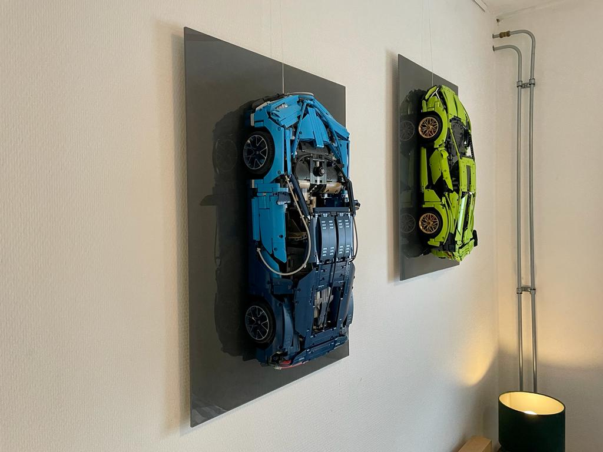

# Lego-Technic-Wall-Display
A picture frame style display for big lego technic cars

The default dimension of the frame is 50X70cm. This is a default dimension for picture frames. There are three types of lego hooks to hold the car to the frame. In my experience, these should be compatible with your car in some combination. 

In the freecad drawing you find a spreadsheet where you can adjust the dimensions of most of the components

## BOM
1. Wood 22X50
1. PMMA 5mm
1. Self-adhesive film foil (I choose Avery SC900-805-M) 
1. screws 5.0X20mm torx
1. screws m5X40mm
1. Aluminum profils 20x10mm

# Mounting hooks

